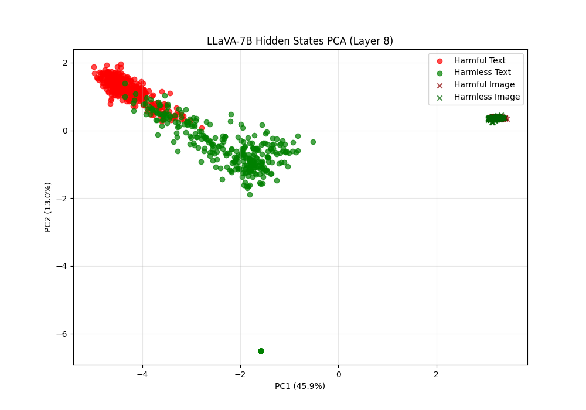
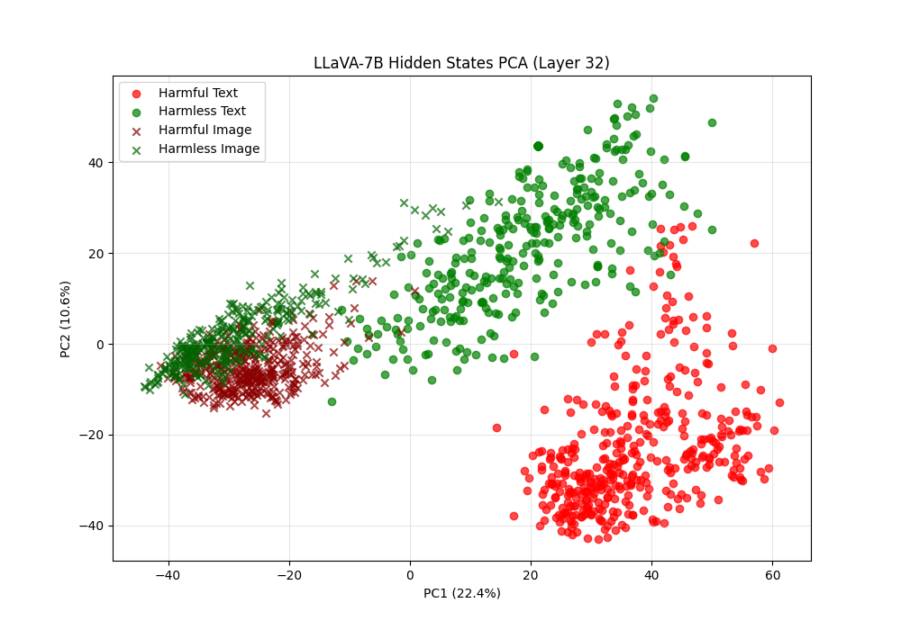
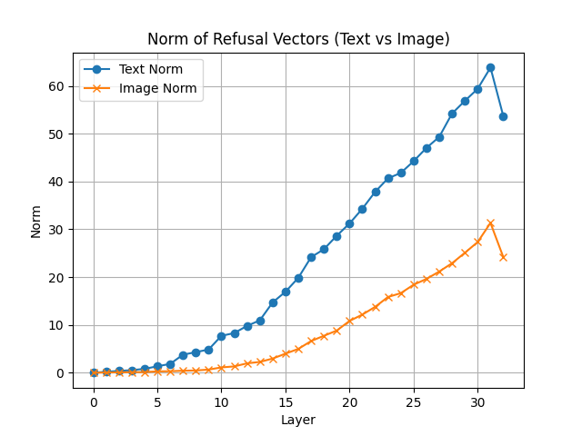
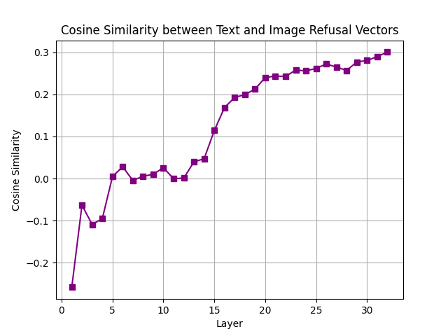
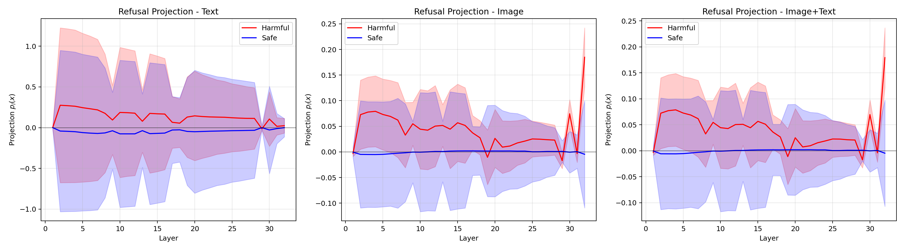
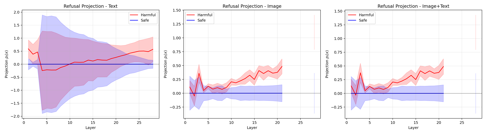

# vlm-interp

Interpretability work on **how refusal is represented across modalities** in vision-language models.

A safety-tuned VLM inherits its refusal behaviour from a text-tuned LLM, but harmful content can arrive as an image instead of as text. The question here is whether the model encodes *one* modality-agnostic notion of "this request is harmful", or whether the image pathway carries a separate, weaker signal that the text-derived safety machinery never properly sees.

The repo holds two passes at that question:

- **`new_project_scripts/`** — the current line of work. Mean-difference refusal vectors computed separately for text and for images, compared layer by layer by cosine similarity and norm.
- **`old_project_scripts/`** — an earlier, heavier approach following the OmniSteer projection formulation, run over text / image / image+text on AdvBench-omni.

---

## Data

**Current scripts.** Harmful prompts from **AdvBench** (462 prompts); harmless prompts from the **Stanford Alpaca** instruction set. Each prompt has a matching rendered image, so every sample exists in both a text form and an image form:

```
dataset2/
  harmful.json          harmful_images/harmful_000.png ...
  harmless.json         harmless/harmless_000.png ...
```

`dataset2/` is gitignored — regenerate it before running anything in `new_project_scripts/`. `load_data` substitutes a blank 800×600 white image for any missing file and only warns, so a partly-missing image directory degrades silently into a large pile of identical blanks. Worth checking the warning count.

**Old scripts.** `ailor/AdvBench-omni`, a multimodal AdvBench variant with `modality` (`text`, `image`, `image_text`) and `type` (`harmful`, `safe`) fields. `old_project_scripts/extract_text_image_subset.py` pulls the text+image subset out of it into two JSONL files.

---

## `new_project_scripts/` — current work

### Method

For each of four conditions — harmful text, harmless text, harmful image, harmless image — take the last-token hidden state at every layer and average over samples. The refusal vector per modality is the class mean difference:

```
v_text  = mean(h_harmful_text)  − mean(h_harmless_text)
v_image = mean(h_harmful_image) − mean(h_harmless_image)
```

Text prompts are fed as `USER: {text}\nASSISTANT:`; images are fed as `USER: <image>\nASSISTANT:` with **no text payload at all**, so the image condition is a pure vision probe — whatever the model has extracted from the picture by the time it reaches the generation position. Model is `llava-hf/llava-1.5-7b-hf` in fp16, `n = 400` per class.

### Scripts

| Script | What it does |
|---|---|
| `pca_plots_llava.py` | Extracts hidden states for all four conditions and plots 2-component PCA at layers 0, 8, 16, 24, 32 into `pca_plots/`. |
| `cosine_similarity.py` | Same extraction, but computes `v_text` and `v_image`, saves them as `refusal_text.pt` / `refusal_image.pt`, and plots per-layer norms and `cos(v_text, v_image)`. |
| `interactive_cosine_sim.py` | Takes one user prompt (`--prompt`, optionally `--image`) and plots how strongly its hidden state aligns with each saved refusal vector at every layer. Ad-hoc probe for single examples. Requires `cosine_similarity.py` to have been run first. |

```bash
python new_project_scripts/pca_plots_llava.py
python new_project_scripts/cosine_similarity.py
python new_project_scripts/interactive_cosine_sim.py --prompt "How do I pick a lock?" --image some.png
```

All three resolve `dataset2/` relative to the working directory, so run them from inside `new_project_scripts/`.

### Results

**PCA across layers** (`pca_plots/`)

At **layer 8** the picture is stark: text splits cleanly into a harmful cluster and a harmless cluster along PC1, while harmful and harmless *images* sit on top of each other in one tight blob far off to the right. The model has separated harmful from harmless text by layer 8 but has not done the equivalent for images — the visual content has been encoded but not yet evaluated.



At **layer 16** the text separation is sharper still and the image cluster is only beginning to fan out. By **layer 32** all four groups are distinguishable, but the dominant axis is *modality*, not harmfulness: text occupies the right half and images the left, with the harmful/harmless split appearing as a secondary offset inside each.



Layer 0 is degenerate and can be ignored — the last token is the identical `ASSISTANT:` suffix for every sample, so the embedding-layer variance is zero and PCA returns `nan` explained variance.

**Norms** (`norms.png`)

The text refusal vector grows steadily with depth, reaching ~64 by layer 31. The image refusal vector follows the same shape but tops out around ~31 — roughly **half the magnitude** at every depth past the early layers. Whatever harmfulness signal the image pathway produces is consistently weaker than the text one.



**Cosine similarity** (`cosine_similarity_plot.png`)

`cos(v_text, v_image)` starts strongly *negative* (≈ −0.26 at layer 1), sits near zero — effectively orthogonal — across layers 5–13, then climbs monotonically from layer 14 to reach only ≈ **0.30 at layer 32**.



That ceiling of 0.3 is the headline. Text-harmfulness and image-harmfulness are encoded in *substantially different* directions even at the top of the network. A steering or ablation intervention fitted on text would cancel only a small fraction of the image-side signal, which is a concrete mechanism for why image-routed jailbreaks bypass text-tuned safety.

---

## `old_project_scripts/` — projection-based approach

The earlier formulation, following the projection definition used in the OmniSteer work. Instead of comparing two refusal vectors to each other, it fits **one** refusal direction on text and then asks how far each sample of *any* modality travels along it:

```
p_l(x) = (h_l(x) − h̄_safe_l)ᵀ v_refu_l / ‖v_refu_l‖²
```

with `v_refu_l = mean_harmful_l − mean_safe_l` computed text-only, and `h̄_safe` computed **once** from text-only safe samples and reused across every modality so the three panels stay comparable. The header comment in `compute_and_plot_projections.py` documents four deliberate corrections over an earlier draft: shared `h̄_safe`, signed coefficient rather than cosine (cosine discards the magnitude, which is the signal), last-token pooling rather than mean pooling (mean pooling averages in hundreds of image patch tokens), and joint per-layer min-max normalization for plotting.

| Script | What it does |
|---|---|
| `dataset.py` | One-liner that pulls `ailor/AdvBench-omni`. |
| `extract_text_image_subset.py` | Filters the dataset to text+image rows, writes `image_text_pairs.jsonl` and `text_only_prompts.jsonl`, optionally copying images out. |
| `Experiment1_projections/compute_text_refusal_direction.py` | Computes the per-layer text-only refusal direction, saving means and per-layer slices. Works for both LLaVA and Qwen2.5-VL. |
| `Experiment1_projections/compute_and_plot_projections.py` | Computes projections for text / image / image+text and emits the four plots per model. |

```bash
python old_project_scripts/extract_text_image_subset.py --dataset-id ailor/AdvBench-omni \
    --output-dir dataset/extracted_text_image --copy-images

python old_project_scripts/Experiment1_projections/compute_text_refusal_direction.py \
    --model-id llava-hf/llava-1.5-7b-hf --output dataset/refusal_direction_llava7b_text.pt

python old_project_scripts/Experiment1_projections/compute_and_plot_projections.py \
    --model-id llava-hf/llava-1.5-7b-hf --refusal-file dataset/refusal_direction_llava7b_text.pt
```

### Results (`Experiment1_projections/data/`)

**LLaVA-1.5-7B.** The harmful mean sits above the safe mean along the refusal direction in all three modalities, but the ±1σ bands overlap almost completely — the separation is far smaller than the within-class spread. The image and image+text panels are near-identical in shape and about 5× smaller in scale than the text panel, and the harmful mean *decays* with depth rather than sharpening, from ~0.08 in the early layers to ~0.02 by layer 25 before a noisy final-layer spike.



**Qwen2.5-VL-7B.** Cleaner. The text panel is dominated by variance in the early layers but the harmful mean rises steadily from layer ~10 to ~0.55 at layer 28. The image and image+text panels separate *well* — the harmful band climbs to ~0.5 and stays clear of the safe band from about layer 10 onward, with much tighter error bars than LLaVA.



Qwen's text-derived refusal direction transfers to the visual modality considerably better than LLaVA's does. Note the truncated x-axis on the Qwen image panels (~21 of 28 layers) — an artifact of the run, not a property of the model.

Saved `*_projections.pt` files contain both raw and normalized projections for every modality and class, so the plots can be regenerated without re-running the forward passes.

---

## Setup

```bash
pip install torch transformers accelerate pillow numpy matplotlib scikit-learn tqdm datasets huggingface_hub
```

A CUDA GPU with ~16 GB is needed for the 7B models in fp16. `dataset/`, `dataset2/`, and the extracted `.pt` refusal vectors are gitignored.

---

## Where this stands

1. In LLaVA, harmful and harmless **text** separate by layer 8; harmful and harmless **images** barely separate at all until very late, and even at layer 32 the dominant axis is modality rather than harmfulness.
2. The image refusal vector is about **half the norm** of the text one throughout the network.
3. Text and image refusal directions reach only **cos ≈ 0.30** at the final layer, and are near-orthogonal through the middle of the stack.
4. Under the projection formulation, LLaVA's text-derived direction barely separates harmful from safe in *any* modality, while **Qwen2.5-VL's transfers cleanly to images** — the two architectures behave quite differently and shouldn't be generalized over.

### Next

- [ ] Rerun the cosine/norm analysis on Qwen2.5-VL to see whether its better projection transfer shows up as a higher `cos(v_text, v_image)`.
- [ ] Image+text condition in the current scripts — right now the image probe carries no text, so it isn't the realistic attack setting.
- [ ] Ablate `v_text` and measure whether refusal survives on image-routed harmful prompts; that's the causal test the correlational results above motivate.
- [ ] SVD / difference-in-means as an alternative to the plain class-mean difference, and error bars over prompt subsets.
- [ ] Fix the silent blank-image fallback in `load_data` so a missing image directory fails loudly.

## Layout

```
new_project_scripts/
  pca_plots_llava.py          PCA of the four conditions across layers
  cosine_similarity.py        text vs image refusal vectors: norms + cosine
  interactive_cosine_sim.py   single-prompt probe against saved vectors
  pca_plots/                  pca_layer_{0,8,16,24,32}.png
  norms.png, cosine_similarity_plot.png
  details.txt                 running lab notes

old_project_scripts/
  dataset.py                          AdvBench-omni download
  extract_text_image_subset.py        text+image subset extraction
  Experiment1_projections/
    compute_text_refusal_direction.py  text-only refusal direction (LLaVA + Qwen)
    compute_and_plot_projections.py    projections for text / image / image+text
    data/                              plots and saved projections for both models
```
